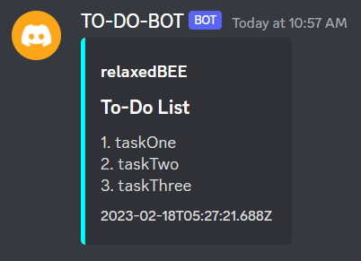

# TO-DO-BOT

### A To-Do bot that uses JDA to interact with discord API using Java

###### An experimental project

#### commands
1. `!add task` - It'll add given task to todoList
1. `!remove index` - will remove given task number from list
1. `!show` - display list of tasks in an embeded message
1. `!clear` - clears the todo list 

### !show

### Getting started
 
create a bot and add `token` in `config.Bot` class 